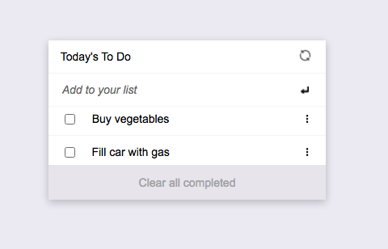

# To do List Web App
A to do list web app compiled through webpack.



The list displays all tasks with a default unmarked status.
Tasks can be marks as done.
Clear button is used to remove done tasks.


## Built With

- HTML
- CSS
- JAVASCRIPT

## Live Demo

[Live Demo Link](https://karelvanoordt.github.io/To-do-list/)


## Getting Started


To get a local copy up and running follow these simple example steps.

Download the files or clone them and use them in your local environment. Also you can fork the repository and continue where you want to.

To be able to run this project locally you must install webpack:

- Follow the instructions adviced in [this page](https://webpack.js.org/guides/getting-started/#basic-setup)

- Follow all the steps from **Basic Setup** to **NPM Scripts**

- Add a new html file using webpack following the steps [from this page](https://webpack.js.org/guides/output-management/#setting-up-htmlwebpackplugin)


Run the nex command:

```npm run build```

- Create a /src/index.html to write the project.

- Change the **webpack.config.js** code to add the **HtmlWebpackPlugin** on your template.

```javascript
plugins: [
  new HtmlWebpackPlugin({
-   title: 'Output Management',
+   template: './src/index.html'
  }),
],
```

- Run `npm run build` to update the **/dist/index.html**. 
- Then it is time to add some style to the project: 
Follow the steps in [loading CSS](https://webpack.js.org/guides/asset-management/#loading-css) guide.
Next, execute `npm run build` and check if the HTML body style has changed.
#### Setup local dev server
- Finally, follow the [using webpack-dev-server](https://webpack.js.org/guides/development/#using-webpack-dev-server) guide and set it up on your local machine.


### Prerequisites

- Have a web browser installed
- Have a code editor installed (e.g: VSCode, Atom)


## Authors

👤 **Karel van Oordt**

- GitHub: [@karelvanoordt](https://github.com/karelvanoordt)
- Twitter: [@karelvanoordtEN](https://twitter.com/karelvanoordtEN)
- LinkedIn: [LinkedIn](https://linkedin.com/in/karelvanoordt)


## 🤝 Contributing

A big shoutout to my coding partners at Microverse.

Feel free to check the [issues page](https://github.com/karelvanoordt/webpack-template/issues).

## Show your support

Give a ⭐️ if you like this project!

## 📝 License

This project is [MIT](./MIT.md) licensed.